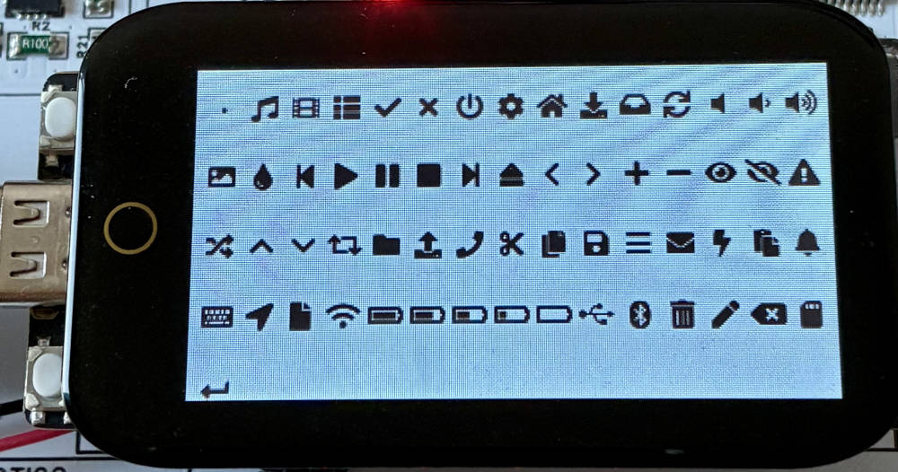

# t-display-s3-lcd-V5.5_Symbole

# Überblick
Dieses Projekt erzeugt eine Ansicht der integrierten Symbole der LVGL V9.2. LVGL ist Tool für sehr einfache grafische Darstellung auf verschiedenen Displays.

Beispiel Ansicht:
<div align="center">

</div>


Hinweiss: In diesem Projekt wurde Elemente aus dem Projekt von Hiruna https://github.com/hiruna/esp-idf-t-display-s3.git verwendet.
Vielen Dank für die sehr gute Arbeit, Hiruna!


## Getestete Hardware & Software Framework(s)
* LilyGO T-Display S3 [v1.2] (ohne Touch) (https://lilygo.cc/products/t-display-s3)
  * ESP-IDF Version 5.5.x ([master branch](https://github.com/espressif/esp-idf))
  * LVGL 9.2.x


## Eigenschaften

Dieses Projekt demonstriert die Zusammenhänge:

* Konfigurieren des ST7789-Displays mit dem I80-Bus (8Bit-Parallel)
* Konfiguration von LVGL/LVGL-Port und Darstellung von Symbolen
* Steuerung der Bildschirmhelligkeit mit [hiruna/esp-idf-aw9364](https://github.com/hiruna/esp-idf-aw9364.git)
  16-stufige Helligkeitsregelung


## Ausgabe:
```
I (673) main_task: Calling app_main()
I (676) esp_idf_t_display_s3: Configuring LCD PWR GPIO...
I (676) LVGL: Starting LVGL task
I (681) esp_idf_t_display_s3: Configuring LCD RD GPIO...
I (689) esp_idf_t_display_s3: Configuring LCD Brightness...
I (695) esp_idf_t_display_s3: aw9364_init
I (698) esp_idf_t_display_s3: Configuring battery monitor...
I (704) esp_idf_t_display_s3: Initializing Intel 8080 bus...
I (709) esp_idf_t_display_s3: Initializing ST7789 LCD Driver...
I (835) esp_idf_t_display_s3: Adding display driver to lvgl port...
I (837) main_task: Returned from app_main()
```


  ## License
  - Copyright (c) 2023 Hiruna Wijesinghe (MIT License)
  - Copyright (c) 2025 JoSmith40 (Apache License Version 2.0)
