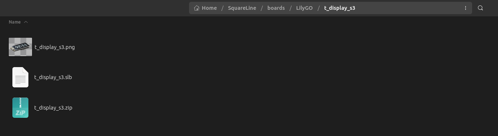
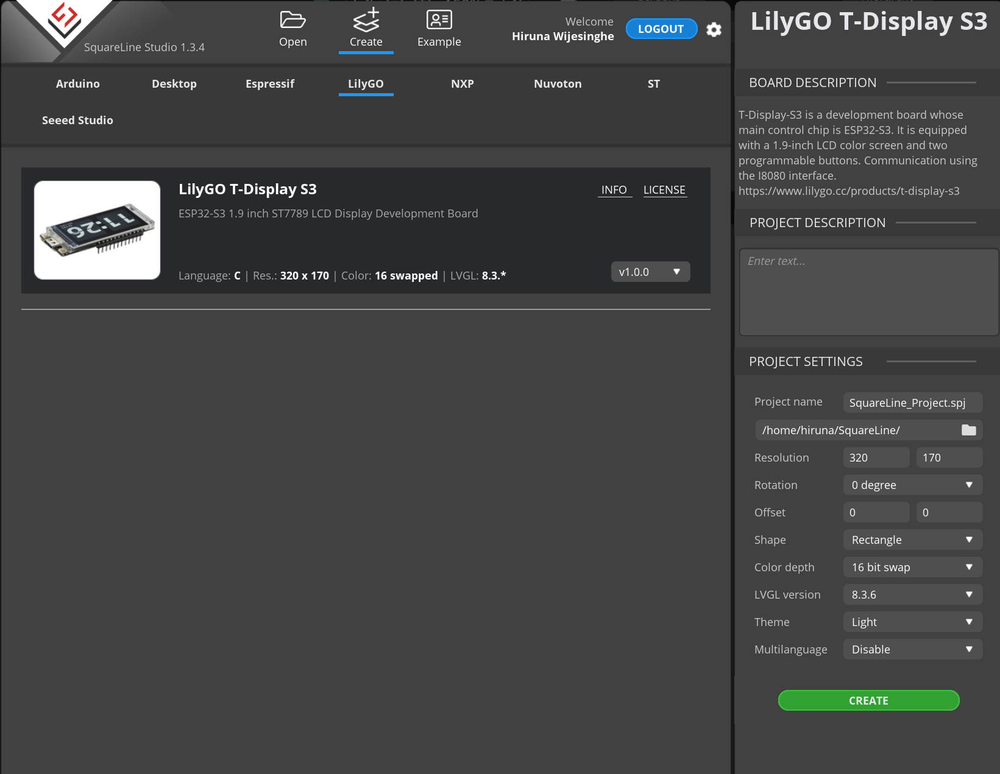

# esp-idf-t-display-s3

# Überblick
Dies ist ein ESP-IDF-Vorlagenprojekt für LilyGO [T-Display S3](https://github.com/Xinyuan-LilyGO/T-Display-S3).

Dieser Code folgt einer ähnlichen Struktur wie der Code, der im [esp-bsp](https://github.com/espressif/esp-bsp) Repo bereitgestellt wird.

Für die vorherige Version des Codes (LVGL 8.3.x & IDF 5.3.x), klicken Sie [hier](https://github.com/hiruna/esp-idf-t-display-s3/tree/idf_5.3.x_lvgl_8.3.x).

## Getestete Hardware & Software Framework(s)
* LilyGO T-Display S3 [v1.2] (nicht berührungsempfindlich)
  * ESP-IDF Version 5.5.x ([master branch](https://github.com/espressif/esp-idf))
  * LVGL 9.2.x

### Anmerkung zu LVGL 9
LVGL Demos waren im Konflikt mit der lvgl port task, siehe Kommentare in `ui_lvgl_demos_task` func für meinen Workaround.

## Fähigkeiten

Dieses Projekt demonstriert die folgenden Fähigkeiten:

* Konfigurieren des ST7789-Displays mit dem I80-Bus
  * Bildschirmausrichtung im Querformat, wobei die Tasten nach links zeigen
* Steuerung der Bildschirmhelligkeit mit [hiruna/esp-idf-aw9364](https://github.com/hiruna/esp-idf-aw9364.git)
  * 16-stufige Helligkeitsregelung
    * HINWEIS: Gemäß dem LilyGO [T-Display S3 Datenblatt](https://github.com/Xinyuan-LilyGO/T-Display-S3/blob/main/schematic/T_Display_S3.pdf) ist die Karte mit einem [AW9364DNR Dimming LED Driver](https://datasheet.lcsc.com/lcsc/1912111437_AWINIC-Shanghai-Awinic-Tech-AW9364DNR_C401007.pdf)
 ausgestattet, der eine 16-stufige Helligkeitsregelung ermöglicht.
* Auslesen der Batteriespannung mittels ADC-Treiber (Oneshot)
  * Batterieladung in Prozent (dank [dieser Gleichung](https://electronics.stackexchange.com/a/551667))
    * Ich verwende einen [3.7v 1150mAh Lithium-Akku](https://www.amazon.com.au/102540-Rechargeable-Motorcycles-Bluetooth-Replacement/dp/B09T3B1D1V?th=1)
      * Die Auflistung erwähnt Li-Po, der Akku sagt Li-ion
* Auslesen der Tasten mit [espressif/button](https://components.espressif.com/components/espressif/button)
  * Im Beispiel wurden die Tasten so konfiguriert, dass sie die Helligkeit des Displays ändern (16 Stufen).

## sdkconfig

Es gibt einige sdkconfig-Optionen, die gesetzt werden müssen, ich habe diese in eine [sdkconfig.defaults](./sdkconfig.defaults) Datei aufgenommen.
  * Ich habe nichts Ausgefallenes mit der Partitionstabelle gemacht, ich verwende einfach eine der Standardeinstellungen `PARTITION_TABLE_SINGLE_APP_LARGE`.
  * Sie können die Anzeige einfach durch Setzen der Optionen `CONFIG_LV_USE_DEMO_BENCHMARK` (erfordert auch `CONFIG_LV_USE_DEMO_WIDGETS`) oder `CONFIG_LV_USE_DEMO_STRESS` einem Benchmark/Stresstest unterziehen.
  * LVGL FPS/CPU Usage Overlay kann mit `CONFIG_LV_USE_PERF_MONITOR=n` deaktiviert werden.

## Hinweise zu LVGL und Speicherverwaltung

Die LVGL- und Anzeigetreiber-Parameter wurden so eingestellt, dass sie das SPI-RAM nutzen. Bei einem LVGL-Benchmark konnte ich über 100 FPS erzielen.
Laut dem [ST7789-Datenblatt] (https://www.rhydolabz.com/documents/33/ST7789.pdf) sollte man 75 FPS anstreben.

## Hinweise zur Bildwiederholrate
Die Bildwiederholrate kann von vielen Faktoren beeinflusst werden. Während meiner Tests habe ich herausgefunden, dass die `LVGL_BUFFER_SIZE` und `LCD_PIXEL_CLOCK_HZ` einen wichtigen Faktor darstellen.

Meiner Meinung nach sollte `LVGL_BUFFER_SIZE` so bleiben, wie es ist (1/10 der Displaygröße in Pixeln), während die `LCD_PIXEL_CLOCK_HZ` angepasst werden kann.

Im [ST7789-Datenblatt](https://www.rhydolabz.com/documents/33/ST7789.pdf) wird ein maximaler Pixeltakt von 17 MHz `(17 * 1000 * 1000)`
erwähnt, aber es kann sein, dass Sie aufgrund der PSRAM-Bandbreite Probleme mit einer hohen Taktrate haben (Quelle: [ESP-FAQ Handbook](https://docs.espressif.com/projects/esp-faq/en/latest/esp-faq-en-master.pdf) [Ende Seite 79]).

## SquareLine Studio

### Erstellen Sie eine neue Tafel

1. Schließen Sie die SquareLine Studio-Anwendung, falls sie bereits läuft.
2. Klonen Sie dieses Repo
2. Navigieren Sie zum Verzeichnis [SquareLine](./SquareLine)
3. Erstellen Sie ein komprimiertes Zip des Verzeichnisses und nennen Sie es `t_display_s3.zip`.
    * Stellen Sie sicher, dass recurse und symbolische Links befolgt werden.
      * Unter Ubuntu habe ich `zip -r t_display_s3.zip __ui_project_name__/` verwendet.
4. Erstellen Sie ein Verzeichnis mit dem Namen `LilyGO` innerhalb des Verzeichnisses `boards` der SquareLine Studio Installation

5. Kopieren Sie das Verzeichnis [boards/t_display_s3](./SquareLine/boards/t_display_s3) in das `LilyGo` Verzeichnis

   * Verschieben Sie die zuvor erstellte Datei „t_display_s3.zip“ in das Verzeichnis „t_display_s3“

6. Öffnen Sie SquareLine Studio, um das T-Display-S3 Board zu sehen

### Erstellen Sie ein neues SquareLine Projekt

1. Erstellen Sie ein neues SquareLine Projekt unter Verwendung des zuvor erstellten Boards
   * Ich habe die Standard-Themeneinstellungen verwendet

2. Sobald das neue Projekt geöffnet ist, klicken Sie auf _**Export -> Create Template Project**_

3. Exportieren Sie die `ui` Dateien, indem Sie auf _**Export -> Export UI Files**_ klicken.
   * Stellen Sie sicher, dass Sie das Verzeichnis „main/ui“ des zuvor exportierten Projekts auswählen

4. Speichern Sie das Projekt
